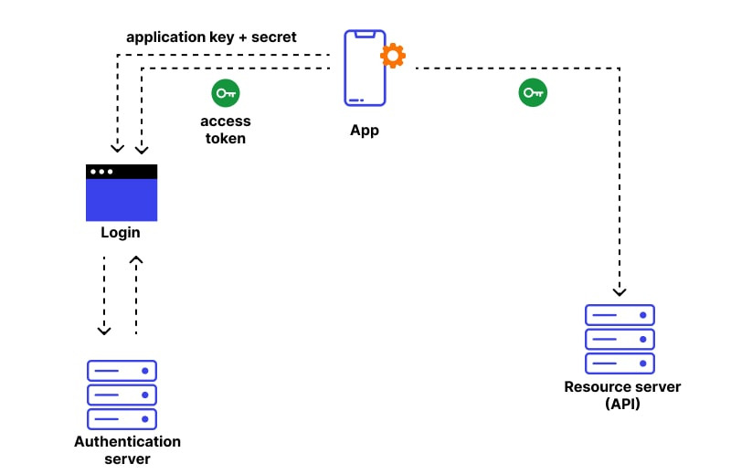
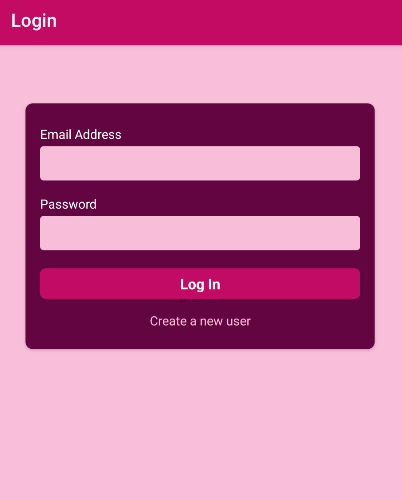
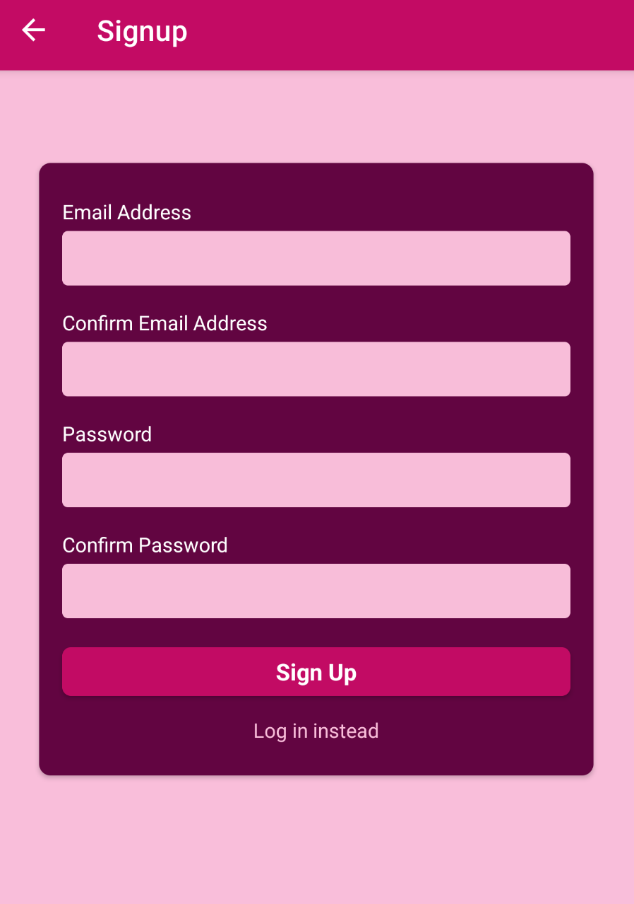

# 🔐 Authentication & 🔔 Notifications in React Native

This section covers the implementation of authentication in React Native,  including user login, signup processes, and managing user sessions securely.   
It involves utilizing libraries like Firebase or custom backend APIs to handle user authentication and maintaining state across app sessions.
 
 
Additionally, this section includes **local notifications** and **push notifications**:

- **Local Notifications**: Users can receive alerts and reminders within the app, even without an internet connection.
   
- **Push Notifications**: These enable real-time updates and messages sent from a server to users' devices, enhancing engagement.
   

## Blog Post ✏️

I documented my study records. 
You can check it by clicking the link below. 
Multilingual support is available by clicking the flag at the top right.

[Blog Post: Authentication](https://oooooooooooo.tistory.com/entry/React-Native-10-1-%EC%9D%B8%EC%A6%9D%EC%9D%80-%EC%96%B4%EB%96%BB%EA%B2%8C-%EC%9D%B4%EB%A3%A8%EC%96%B4%EC%A7%88%EA%B9%8C)

[Blog Post: Notification](https://oooooooooooo.tistory.com/entry/React-Native-11-1-%EB%A1%9C%EC%BB%AC-%EC%95%8C%EB%A6%BCLocal-Notifications)

 

 
 
 

## Implementation Screen 📱

 
